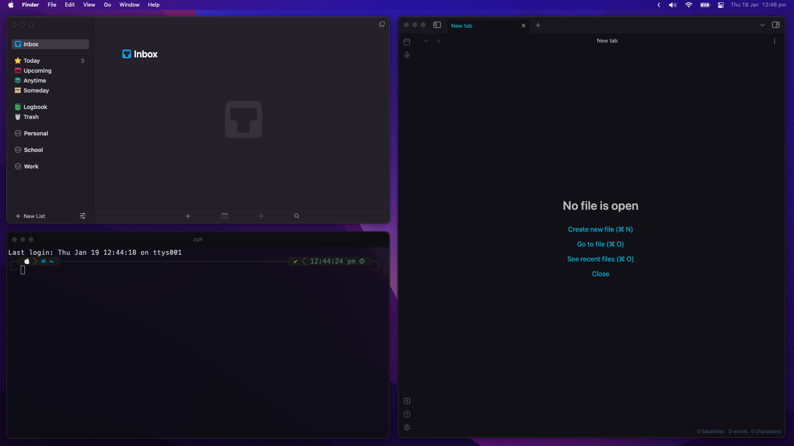

# Phoenix Configuration
Config files for the MacOS lightweight window management app, [phoenix](https://github.com/kasper/phoenix).

My setup is a simplified version of padded window management for people who only want the basics with easy controls. It also has multi display support.

Thank you to [Jaredk3nt](https://github.com/Jaredk3nt/phoenix-padding) and [christopherbruce](https://github.com/christopherbruce/phoenix-padding)'s configurations for most of the code.

---

## Shortcuts

#### Halves
Left Half:
<kbd>&larr;</kbd> + <kbd>[ctrl + alt + cmd]</kbd>

Right Half:
<kbd>&rarr;</kbd> + <kbd>[ctrl + alt + cmd]</kbd>

#### Quarters
Bottom Quarter:
<kbd>&darr;</kbd> + <kbd>[ctrl + alt + cmd]</kbd>

Top Quarter:
<kbd>&uarr;</kbd> + <kbd>[ctrl + alt + cmd]</kbd>

#### 4 Corners, 4 Keys
Top Right:
<kbd>]</kbd> + <kbd>[ctrl + alt + cmd]</kbd>

Bottom Right:
<kbd>'</kbd> + <kbd>[ctrl + alt + cmd]</kbd>

Top Left:
<kbd>[</kbd> + <kbd>[ctrl + alt + cmd]</kbd>

Bottom Left:
<kbd>;</kbd> + <kbd>[ctrl + alt + cmd]</kbd>

#### Maximize & Fullscreen
Maximize:
<kbd>return</kbd> + <kbd>[ctrl + alt + cmd]</kbd>

Fullscreen:
<kbd>f</kbd> + <kbd>[ctrl + alt + cmd]</kbd>

---

## Other Notes

#### Multi Display Support (2 Displays)

To send a window to the other display with this config, it's easy, just add <kbd>shift</kbd> to the shortcut. For example, to put a window on the **left half** of the other display, it's <kbd>&larr;</kbd> + <kbd>[ctrl + alt + cmd]</kbd> + <kbd>shift</kbd>.

#### But pressing <kbd>[ctrl + alt + cmd]</kbd> is too much!
I rebound my <kbd>ctrl + alt + cmd</kbd> to <kbd>caps lock</kbd> for easy use. The app I use for this is [Hyperkey](https://hyperkey.app/). But if you want to change the modifer keys from <kbd>[ctrl + alt + cmd]</kbd>, just edit the code!
